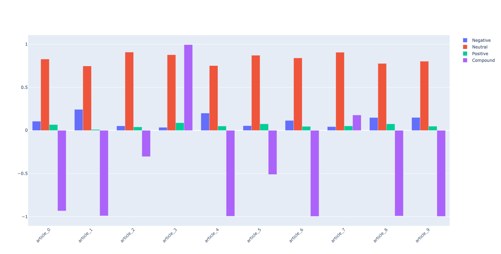

# programming-challenge
Summer 2022 Programming Challenge

The specific task will be to create a pipeline that collects and analyzes news articles from the web. Given a short list of curated websites, your script should be able to collect the latest news articles (via web scraping) and run them through some basic sentiment analysis.

## Setup

Create a Python 3.8+ environment with Conda and `requirements.txt` file. Please replace `<env_name>` with any name you want.

```python
conda create python=3.8 --name <env_name> --file requirements.txt 
```

## Collect latest news via web scraping

Collect 10 most recent articles from https://www.aljazeera.com/where/mozambique/ Include collected articles as a JSON file in your submission repository.

### Format of the JSON file

The collected news articles will be stored in the default JSON file, `articles.json`. Each article corresponds to a JSON object, which contains the following infomation of this article:

- article_link: the URL of this article
- header: the header of this article
- sub_header:  the sub header of this article
- img_link: image URL
- img_cap: image caption
- date: published date
- content: the text content of this article

Here is an example showing the format intuitively.

```json
{
    "article_0": {
        "article_link": "https://www.aljazeera.com/news/2022/5/23/floods-hit-south-africas-kwazulu-natal-province-again",
        "header": "Floods hit South Africa\u2019s KwaZulu-Natal province again",
        "sub_header": "The floods are happening only a month after torrential rains killed 435 people in the KwaZulu Natal province.",
        "img_link": "https://www.aljazeera.com/wp-content/uploads/2022/04/000_328D8LB.jpg?resize=770%2C513",
        "img_cap": "Neighbours watch as members of the South African Police Services Search and Rescue Unit use sniffer dogs to locate 10 people who are unaccounted for, around KwaNdengezi township outside Durban, on April 15, after their homes were swept away by the devastating rains and flooding [Phill Magakoe/AFP]\u00a0",
        "date": "Published On 23 May 2022",
      	"content": "..."
    },
    "article_1":{
        ...
    },
    ...
}
```

## Sentiment analysis 

The code support two methods to compute sentiment of news articles.

- [VADER](https://github.com/cjhutto/vaderSentiment) (recommended)
- [Hugging Face: Sentiment analysis pipeline (DistilBERT)](https://huggingface.co/docs/transformers/main_classes/pipelines#transformers.pipeline)

NOTE: The second approach uses the [DistilBERT model](https://huggingface.co/distilbert-base-uncased-finetuned-sst-2-english?text=I+like+you.+I+love+you) for sentiment analysis, which only can handle 512 tokens (words) and run slowly. Hence, the first one, VADER, is the recommended and default method. 

### Run `sentiment_analysis.py`

Create an enviroment following [Setup](##Setup), and then run the following command line.

```bash
python3 src/sentiment_analysis.py  # using the following default setting

python3 src/sentiment_analysis.py --num_articles 10 \  # the number of collected articles
																	--out_path 'articles.json' \  # file path of scraped articles
																	--method VADER \  # choose method VADER or DistilBERT to analyze sentiment
																	--res_path 'sentiment_analysis.json'  # file path of sentiment analysis results
```

This command line will create 2 JSON file:

- [`articles.json`](./articles.json): contains 10 collected latest news articles
- [`sentiment_analysis.json`](./sentiment_analysis.json): contains the sentiment analysis result of each article

Besides, the visualization of sentiment created by `plotly` will pop up on your browser.

PS:

[sentiment_analysis_bert.json](./sentiment_analysis_bert.json) is created by 

```bash
python3 src/sentiment_analysis.py --num_articles 10 \ 
																	--out_path 'articles.json' \  
																	--method DistilBERT \  
																	--res_path 'sentiment_analysis_bert.json'  
```

[sentiment_analysis_vader.json](./sentiment_analysis_vader.json) is created by 

```bash
python3 src/sentiment_analysis.py --num_articles 10 \ 
																	--out_path 'articles.json' \  
																	--method VADER \  
																	--res_path 'sentiment_analysis_vader.json'  
```

### Results

The following results are generated with VADER. Accoding to [VADER's document](https://github.com/cjhutto/vaderSentiment#about-the-scoring), the typical threshold values for classifying sentences are:

> 1. **positive sentiment**: `compound` score >= 0.05
> 2. **neutral sentiment**: (`compound` score > -0.05) and (`compound` score < 0.05)
> 3. **negative sentiment**: `compound` score <= -0.05




Hence, among the 10 most recent articles from https://www.aljazeera.com/where/mozambique/, only `article_3` and `article_7` shows positive sentiment. The sentiments of the rest are negative. 

> article_3: [Analysis: Can African gas replace Russian supplies to Europe?](https://www.aljazeera.com/economy/2022/3/1/analysis-can-african-gas-replace-russian-supplies-to-europe)
>
> article_7: [Rwanda, Mozambique forces recapture port city from rebels](https://www.aljazeera.com/news/2021/8/8/rwanda-mozambique-forces-recapture-port-city-from-rebels)

### Running time 

Using VADER is faster than using DistilBERT.

- VADER: 4.3903 seconds
- Hugging Face: Sentiment analysis pipeline (DistilBERT): 22.5683 seconds
